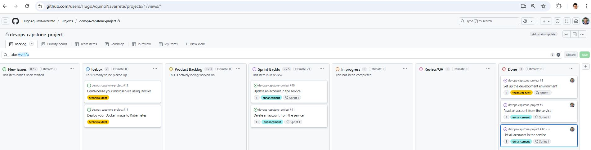
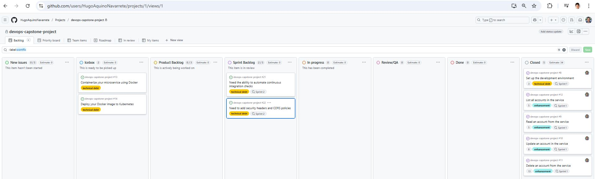
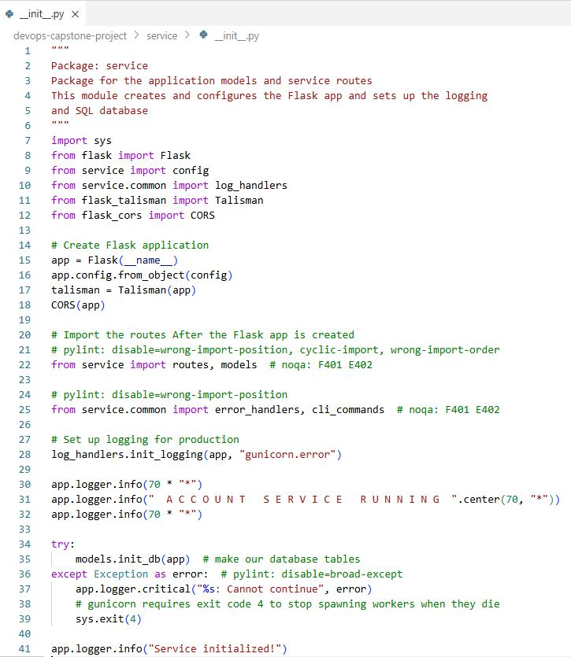

# DevOps Capstone Template


[](https://opensource.org/licenses/Apache-2.0)
[](https://shields.io/)

This repository contains the starter code for the project in [**IBM-CD0285EN-DevOps and Software Engineering Capstone Project**](https://courses.edx.org/courses/course-v1:IBM+CD0285EN+3T2022/) which is part of the [**IBM DevOps and Software Engineering Professional Certificate**](https://www.edx.org/certificates/professional-certificate/ibm-devops-and-software-engineering)

Adjusted by **[Hugo Aquino](https://www.linkedin.com/in/hugoaquino/) - Panama City, August 2025**.

## Usage

You should use this template to start your DevOps Capstone project. It contains all of the code that you will need to get started.

Do Not fork this code! It is meant to be used by pressing the  <span style=color:white;background:green>**Use this Template**</span> button in GitHub. This will copy the code to your own repository with no connection back to the original repository like a fork would. This is what you want.

## Development Environment

These labs are designed to be executed in the IBM Developer Skills Network Cloud IDE with OpenShift. Please use the links provided in the Coursera Capstone project to access the lab environment.

Once you are in the lab environment, you can initialize it with `bin/setup.sh` by sourcing it. (*Note: DO NOT run this program as a bash script. It sets environment variable and so must be sourced*):

```bash
source bin/setup.sh
```

This will install Python 3.9, make it the default, modify the bash prompt, create a Python virtual environment and activate it.

After sourcing it you prompt should look like this:

```bash
(venv) theia:project$
```

## Useful commands

Under normal circumstances you should not have to run these commands. They are performed automatically at setup but may be useful when things go wrong:

### Activate the Python 3.9 virtual environment

You can activate the Python 3.9 environment with:

```bash
source ~/venv/bin/activate
```

### Installing Python dependencies

These dependencies are installed as part of the setup process but should you need to install them again, first make sure that the Python 3.9 virtual environment is activated and then use the `make install` command:

```bash
make install
```

### Starting the Postgres Docker container

The labs use Postgres running in a Docker container. If for some reason the service is not available you can start it with:

```bash
make db
```

You can use the `docker ps` command to make sure that postgres is up and running.

## Project layout

The code for the microservice is contained in the `service` package. All of the test are in the `tests` folder. The code follows the **Model-View-Controller** pattern with all of the database code and business logic in the model (`models.py`), and all of the RESTful routing on the controller (`routes.py`).

```text
├── service         <- microservice package
│   ├── common/     <- common log and error handlers
│   ├── config.py   <- Flask configuration object
│   ├── models.py   <- code for the persistent model
│   └── routes.py   <- code for the REST API routes
├── setup.cfg       <- tools setup config
└── tests                       <- folder for all of the tests
    ├── factories.py            <- test factories
    ├── test_cli_commands.py    <- CLI tests
    ├── test_models.py          <- model unit tests
    └── test_routes.py          <- route unit tests
```

## Data Model

The Account model contains the following fields:

| Name | Type | Optional |
|------|------|----------|
| id | Integer| False |
| name | String(64) | False |
| email | String(64) | False |
| address | String(256) | False |
| phone_number | String(32) | True |
| date_joined | Date | False |

## Your Task

Complete this microservice by implementing REST API's for `READ`, `UPDATE`, `DELETE`, and `LIST` while maintaining **95%** code coverage. In true **Test Driven Development** fashion, first write tests for the code you "wish you had", and then write the code to make them pass.

## Local Kubernetes Development

This repo can also be used for local Kubernetes development. It is not advised that you run these commands in the Cloud IDE environment. The purpose of these commands are to simulate the Cloud IDE environment locally on your computer. 

At a minimum, you will need [Docker Desktop](https://www.docker.com/products/docker-desktop) installed on your computer. For the full development environment, you will also need [Visual Studio Code](https://code.visualstudio.com) with the [Remote Containers](https://marketplace.visualstudio.com/items?itemName=ms-vscode-remote.remote-containers) extension from the Visual Studio Marketplace. All of these can be installed manually by clicking on the links above or you can use a package manager like **Homebrew** on Mac of **Chocolatey** on Windows.

Please only use these commands for working stand-alone on your own computer with the VSCode Remote Container environment provided.

1. Bring up a local K3D Kubernetes cluster

    ```bash
    $ make cluster
    ```

2. Install Tekton

    ```bash
    $ make tekton
    ```

3. Install the ClusterTasks that the Cloud IDE has

    ```bash
    $ make clustertasks
    ```

You can now perform Tekton development locally, just like in the Cloud IDE lab environment.

## Results

* Planning story template:


* Planning user stories:


* Planning product backlog:


* Planning labels:


* Planning kanban:


* REST setup configuration:


* REST technical debt:


* Read accounts:


* List accounts:



* Update accounts:


* Delete accounts:


* REST create:


* REST read:


* REST list:


* REST update:


* REST delete:


* Sprint 2 plan:



* CI workkflow:


* CI badge:


* CI kanban:


* Security code:



* Security headers:


* Security kanban:


* Sprint 3 plan:


* Kube app output:


* Kube docker:


* Kube images:


* Kube deploy accounts:


* Kube kubernetes:


* CD pipeline:


## Author

[John Rofrano](https://www.coursera.org/instructor/johnrofrano), Senior Technical Staff Member, DevOps Champion, @ IBM Research, and Instructor @ Coursera

## License

Licensed under the Apache License. See [LICENSE](LICENSE)

## <h3 align="center"> © IBM Corporation 2022. All rights reserved. <h3/>
